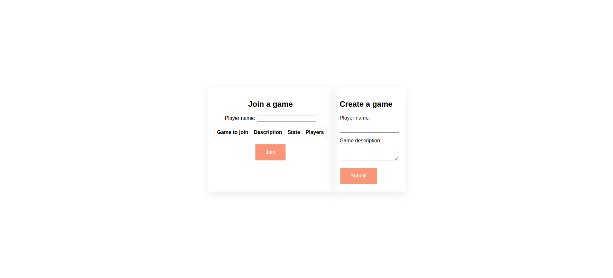
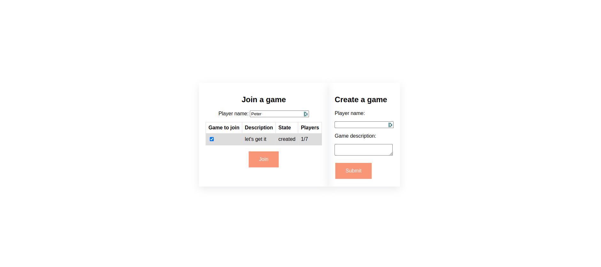
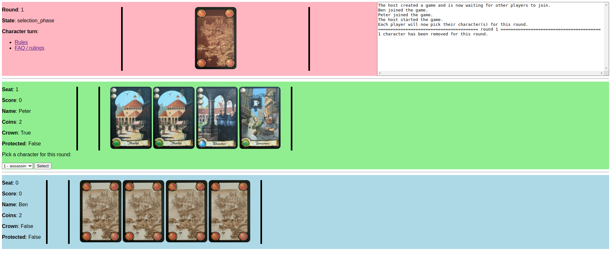
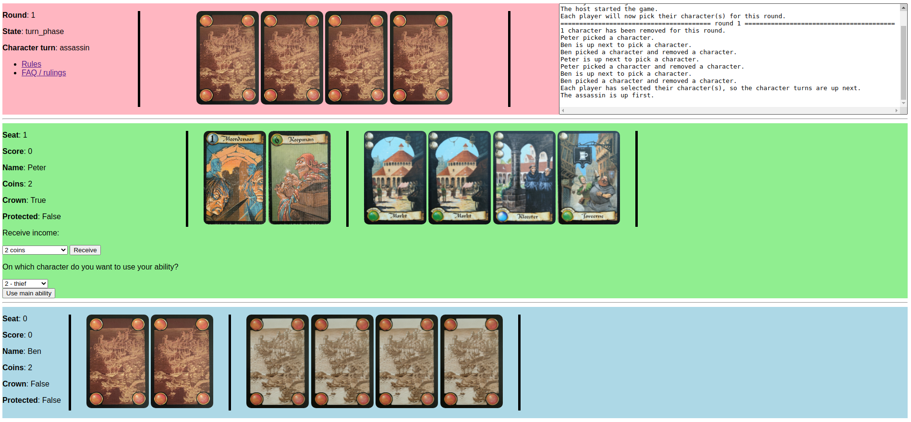
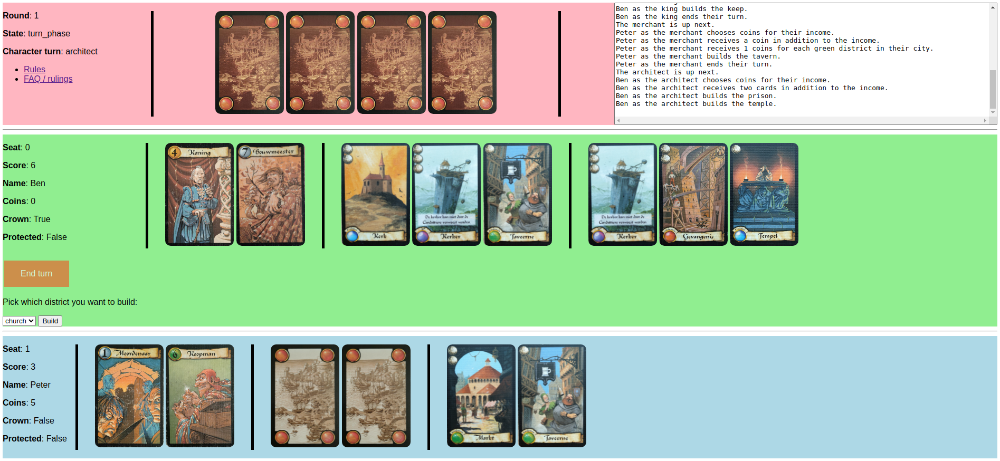

# Citadels client

A python application using the [flask](https://flask.palletsprojects.com/en/2.1.x/) framework to communicate with the [citadels API](https://github.com/benblanc/citadels-API) and allow people to play [citadels](https://boardgamegeek.com/boardgame/478/citadels) through their web browser.

**This project is in no way intended for commercial purposes**.

I hope everyone has fun playing this wonderful game together!

## Getting started

[Open a terminal](https://atom.io/packages/open-terminal-here) at the location of this cloned/downloaded repository and run these commands:

1. Create a virtual environment, if it doesn't exist:
    ``` bash
    python3 -m venv ./venv
    ```

2. Activate the virtual environment:
    ``` bash
    source venv/bin/activate
    ```

3. Install the required packages:
    ``` bash
    pip install -r requirements.txt
    ```

4. Set the environment:
    ``` bash
    export PYTHON_ENV=local 
    ```

5. Run the application:
    ``` bash
    python main.py
    ```

While the application is running, you can play games by opening a web browser of your choice and going to this URL:

``` text
http://127.0.0.1:8081
```

Follow the instructions there to create games or join already created games.

### Prerequisites

This application was programmed using [python 3.7](https://www.python.org/downloads/release/python-3712/):

* If you have python 3 installed on your system, try using that first
* If you don't have python installed on your system, download python 3.7

## Play online with friends

1. To play with friends, someone needs to run the [citadels API](https://github.com/benblanc/citadels-API) and that same person needs to run the citadels client (this application).
2. The person running both applications needs to find out the IP address of their PC
3. The person running both applications needs to enable port forwarding on their router for the IP address of the PC and the port needs to be 8081
4. The person running both applications needs to give their [public IP address](https://www.whatismyip.com/) to their friends
5. Everyone can now play the game by going to this URL and replacing the placeholder with the public IP adress they received:
    ``` text
    http://REPLACE_WITH_PUBLIC_IP_ADDRESS:8081
    ```

The person running the applications should not forget to turn of port forwarding when they are done playing to prevent security issues.

## Notes

This application was tested using Google Chrome.

The page where the player is on will refresh where a player performs an action which isn't allowed. Currently, no error messages are shown.

The images for the cards are in Dutch, but if you hover over a card the English name will be shown.

## Screenshots










